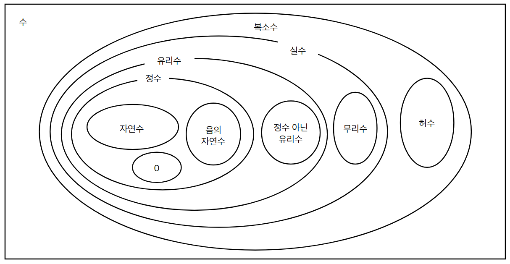

# 2.1 수와 집합

## 소박한 집합론(Naive set theory)

- 서로 구분되는 원소(Element)로 구성된 묶음을 집합이라고 정의하는 집합론
- 수집합의 분류
  | 분류 | 정의 | 기호 |
  | ------ | -------------------------------------------------------------------------------------------------- | ---- |
  | 자연수 | 물건을 세거나 순서 지정에 사용되는 수집합 | N |
  | 정수 | 자연수, 자연수의 음수, 0을 포함하는 수집합 | Z |
  | 유리수 | 분모가 0이 아닌 두 정수 비율, 또는 분수로 나타낼 수 있는 수집합 | Q |
  | 무리수 | 두 정수 비율, 또는 분수로 나타낼 수 없는 수집합 | I |
  | 실수 | 유리수와 무리수를 포함하는 수집합 | R |
  | 복소수 | 실수 a, b, 제곱하면 -1이 되는 허수 i 를 조합해 a + bi 형태로 나타내는 수집합 | C |
  | 사원수 | 실수 a, b, c, d, 제곱하면 -1이 되는 허수 i, j, k 를 조합해 a + bi + cj + dk 형태로 나타내는 수집합 | H |
- 집합과 원소의 관계

---

## 공리적 집합론(Axiomatic set theory)

- 공리(Axiom)
  - 집합의 성질을 참과 거짓으로 명확하게 구분해줄 수 있는 명제 중에서, **너무 당연해서 증명할 필요가 없는 기본 명제**
- 위의 공리(Axiom) 을 기반으로 대상을 구분하는 집합론을 ‘공리적 집합론’ 이라고 함.
- 공리(Axiom) 를 기반으로 수를 분류함.

---

## 2.1.1 연산과 수의 구조

- 이항연산(Binary operation)
  - 수집합의 원소 2개를 이용해서 새로운 원소를 만들어내는 연산
  - 덧셈, 뺄셈, 곱셈, 나눗셈의 사칙연산 적용
- 이항연산의 특징
  - 닫혀 있다(Closure)
    - 같은 집합에 속한 두 수를 투입한 이항연산의 결과가 항상 투입한 두 수와 같은 집합에 속한다면, 이 연산은 해당 집합에 **닫혀 있다**고 함.
  - 교환법칙
    - 임의의 두 수 a, b 연산에서 순서와 관계없이 항상 동일한 결과가 나오는 성질
    - $a + b = b + a$
    - $a*b=b*a$
  - 결합법칙
    - 연산이 두 번 이상 연속될 때, 앞의 연산을 먼저 하든, 뒤의 연산을 먼저 하든 결과가 동일한 성질
    - $(a+b)+c = a+(b+c)$
    - $(a*b)*c = a*(b*c)$
  - 분배법칙
    - 서로 다른 2개의 연산에 대해 아래의 규칙이 성립함
    - $a*(b+c) = a*b+a*c$
    - $(b+c)*a = b*a+c*a$
  - 항등원(Identity)
    - 임의의 수와 연산결과가 항상 자기자신이 나오게 하는 수
    - 덧셈의 항등원
      - $a+0=a$
      - 덧셈의 항등원은 0
    - 곱셈의 항등원
      - $a*1=a$
      - 곱셈의 항등원은 1
  - 역원(Inverse)
    - 연산결과를 항상 항등원으로 만들어주는 수
    - 덧셈의 역원
      - $a+(-a)=0$
      - a의 덧셈의 역원은 -a
      - 덧셈의 역원은 부호가 반대인 수가 됨 → 반대수(Opposite number)
    - 곱셈의 역원
      - $a*(1/a)=1$
      - a의 곱셈의 역원은 1/a
      - 곱셈의 역원은 분자가 1이고 분모가 a가 됨 → 역수(Reciprocal)
      - 단, 분모가 0인 분수는 없으므로, **0의 곱셈의 역원은 없다**

---

## 2.1.2 수의 구조

- 공리적 집합론에서 연산에 대한 **11개 공리**
  - 한 번의 연산에 대한 공리
    1. 연산에 대해 닫혀있다.
    2. 연산에 대해 결합법칙이 성립한다.
    3. 연산에 대한 항등원이 존재한다.
    4. 연산에 대한 역원이 존재한다.
    5. 연산에 대해 교환법칙이 성립한다.
  - 두 번의 연산에 대한 공리
    1. 두 번째 연산에 대해 닫혀있다.
    2. 두 번째 연산에 대해 결합법칙이 성립한다.
    3. 첫 번째 연산과 두 번째 연산에 대해 분배법칙이 성립한다.
    4. 두 번째 연산에 대해 교환법칙이 성립한다.
    5. 두 번째 연산에 대해 항등원이 존재한다.
    6. 두 번째 연산에 대해 역원이 존재한다.(단, 0은 제외)
- 수집합별 11개 공리 만족 여부
  - 자연수(N): 덧셈에 대한 역원이 음수이므로 자연수에 존재하지 않음.
  - 정수(Z): 곱셈에 대한 역원이 유리수이므로 정수에 존재하지 않음.
  - **유리수(Q), 실수(R)**: 곱셈이 역원이 존재하므로 **11개 공리 모두 만족**
- 체(Field)의 구조
  - 공리적 집합론에서 두 연산에 대해 11개의 공리를 모두 만족하는 수 집합을 **체의 구조**를 지난다고 함.
  - 유리수(Q), 실수(R) 이 체의 구조를 갖는 수집합
  - 덧셈과 곱셈을 예외상황 없이 안전하고 자유롭게 사용할 수 있음.

---

## 2.1.3 수의 표현

- 수직선(Number line)
  - 체의 구조를 만족하는 수집합 실수(R) 를 대응시켜 표현한 직선
  - 실수의 모든 원소는 수직선 상에 자신의 고유한 위치를 가짐.
  - 0을 기준으로 양수와 음수라는 두 개의 체계가 서로 대칭됨
    - 원점에서 크기와 방향을 갖는 화살표로도 표현 가능.
      - 수가 지니는 방향은 **부호**로 표현
      - 수가 지니는 크기는 **원점으로부터의 거리**를 의미
        - 어떤 수의 원점으로부터의 거리는 **절댓값**(Absolute value)라고 함
        - $|-3|=3$
