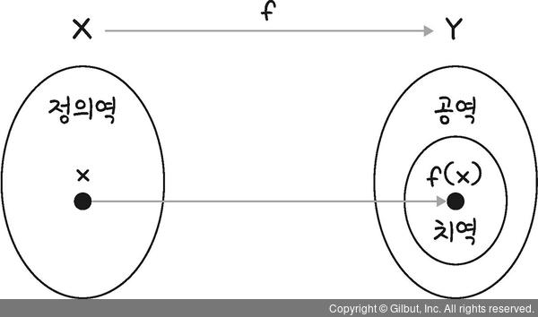
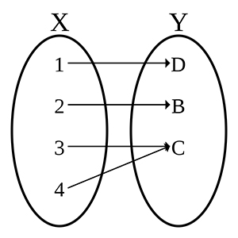
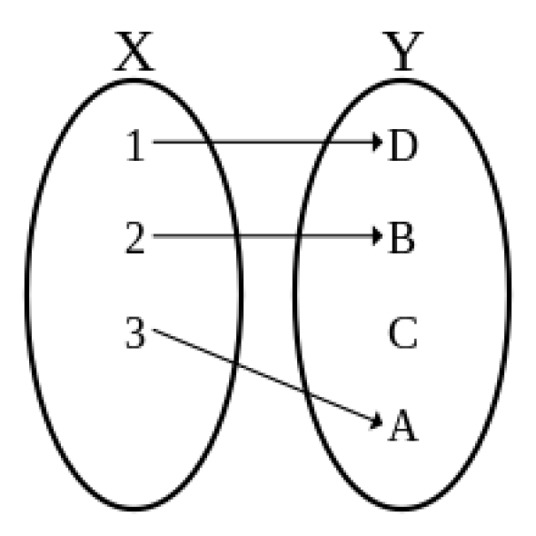

# 2.2 함수

## 2.2.1 함수의 개념과 종류

- 함수(Function)란, 첫 번쨰 집합의 모든 원소가 **빠짐없이** 두 번째 집합의 원소에 대응하는 관계
- 두 집합에 대해 다음 두 규칙이 성립해야 함수로 인정받음.
  1. 첫 번째 집합의 **\*모든 원소에 대한 대응관계**가\* 존재
  2. 첫 번째 집합의 원소는 **_두 번째 집합의 한 원소에만 대응_**
- 정의역, 공역, 치역의 개념
  - 정의역(Domain): 함수에서 왼쪽에 위치한 첫 번째 집합 → 입력(Input)
  - 공역(Codomain): 함수에서 오른쪽에 위치한 두 번째 집합 → 출력(Output)
  - 치역(Range): 정의역에 대응되는 공역의 원소만 따로 모아놓은 부분집합(Subset)  
    
- 전사함수(Surjection)
  - 공역의 모든 요소가 정의역에 대응되는 함수
  - 공역과 치역이 동일한 함수  
    
- 단사함수(Injection)
  - 정의역과 공역의 요소가 일대일로 대응되는 함수  
    
- 전단사함수(Bijection)
  - 정의역과 공역의 모든 요소가 빠짐없이 일대일로 대응되는 함수  
    .jpg>)

## 2.2.2 합성함수

- 함수의 합성 (Function composition)
  - 2개의 함수를 연쇄적으로 이어서 하나의 함수를 만드는 연산
  - 중간에 위치한 집합 Y 를 생략하고 X 와 Z 의 직접적인 대응관계로 표현할 수 있음.
  - $g(f(x))$ 또는 $g∘f$ 로 표시할 수 있음. → 먼저 실행하는 합성함수 $f$가 오른쪽에 놓임
  - $(h ∘ (g ∘ f))(w)$ 와 $((h ∘ g) ∘ f)(w)$ 의 결과는 동일한 대응관계를 가짐 → 합성함수는 결합법칙이 성립함.  
    

## 2.2.3 항등함수와 역함수

- 항등함수(Identity function)
  - 정의역과 공역이 동일한 값으로 대응되는 함수
  - 항등함수 $id$ 에 대하여, $id ∘ f = f$ 이고, $f ∘ id = f$ 이므로, 항등함수는 어느 위치에 있든지 합성의 결과가 원함수와 동일한 대응관계를 나타냄.  
    
- 역함수(Inverse function)
  - 합성함수의 대응결과가 항등함수가 되도록 하는 함수. $f^-1$ 로 표현
  - 어떤 함수와 역함수를 합성한 결과는 언제나 항등함수가 됨.
  - 어떤 함수가 역함수를 가지려면 반드시 **전단사함수의 형태**가 되어야 함.
  - $f^-1 ∘ f = id$
  - $f ∘ f^-1 = id$
  - $(g ∘ f)^-1 = f^-1 ∘ g^-1$  
    

## 2.2.4 곱집합을 활용한 좌표 평면으로의 확장

- 곱집합(Cartesian product)
  - 두 집합의 원소를 **순서쌍으로** 묶은 원소의 집합
  - 두 집합 A 와 B 요소를 서로 수직으로 배치해 묶을 수 있음.
  - $A × B$ 으로 표현
  - 각각 하나의 직선으로 표현한 두 실수 집합의 곱집합 $R × R$ 을 아래와 같이 평면으로 확장할 수 있음.  
    
